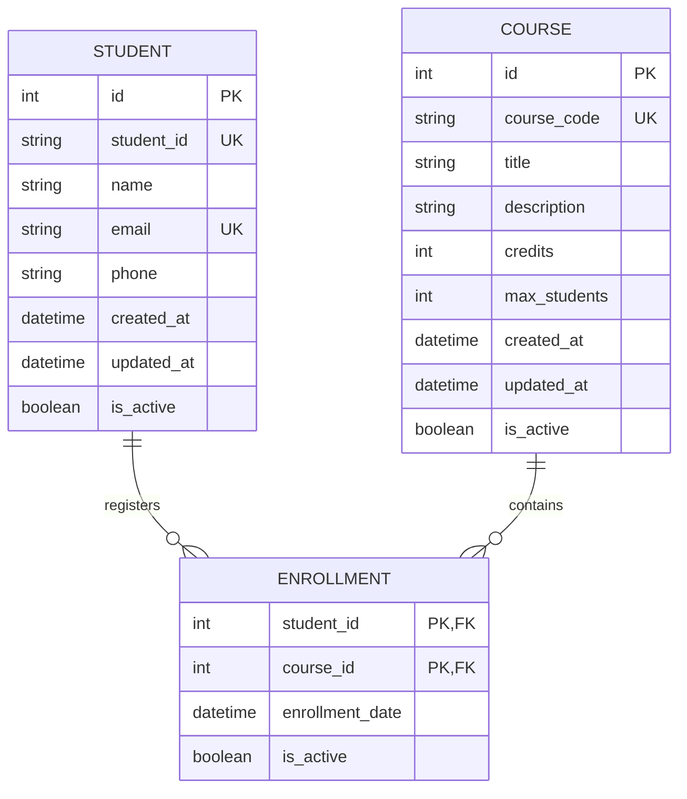

# 學生選課管理系統API

這是一個使用FastAPI框架開發的學生選課管理系統API，提供學生、課程管理和選課功能。

## 快速開始

### 在線示例

您可以通過以下地址直接訪問並體驗本系統：

- API 入口：http://crud.comalot.me:8000/
- API 文檔：http://crud.comalot.me:8000/docs

無需安裝，直接在瀏覽器中嘗試各項功能。

### 使用 Docker 運行應用

```bash
# 從 GitHub Container Registry 拉取
docker pull ghcr.io/123hi123/coursecrud:latest

# 或從 Docker Hub 拉取
docker pull joeapi/coursecrud:latest

# 運行容器 (Windows PowerShell)
docker run -d -p 8000:8000 -v "D:\file\docker\ccrud:/app/data" --name coursecrud-api ghcr.io/123hi123/coursecrud:latest
# 或
docker run -d -p 8000:8000 -v "D:\file\docker\ccrud:/app/data" --name coursecrud-api joeapi/coursecrud:latest

# Linux/Mac 環境
docker run -d -p 8000:8000 -v "/path/to/local/data:/app/data" --name coursecrud-api ghcr.io/123hi123/coursecrud:latest
# 或
docker run -d -p 8000:8000 -v "/path/to/local/data:/app/data" --name coursecrud-api joeapi/coursecrud:latest
```

重要提示：掛載目錄必須指向 `/app/data`，這是應用存儲數據庫文件的位置。

### 管理運行中的容器

如果您已經運行了容器，並需要更新到最新版本，可以使用以下命令：

```bash
# 停止現有容器
docker stop coursecrud-api

# 刪除現有容器 (保留數據，因為數據保存在掛載卷中)
docker rm coursecrud-api

# 拉取最新映像
docker pull ghcr.io/123hi123/coursecrud:latest
# 或
docker pull joeapi/coursecrud:latest

# 使用相同的配置啟動新容器
docker run -d -p 8000:8000 -v "D:\file\docker\ccrud:/app/data" --name coursecrud-api ghcr.io/123hi123/coursecrud:latest
# 或
docker run -d -p 8000:8000 -v "D:\file\docker\ccrud:/app/data" --name coursecrud-api joeapi/coursecrud:latest
```

快速重啟容器：

```bash
# 重啟現有容器 (不更新映像)
docker restart coursecrud-api
```

查看容器日誌：

```bash
# 查看容器日誌
docker logs coursecrud-api

# 持續查看日誌
docker logs -f coursecrud-api
```

### 使用 GitHub Container Registry 映像

你可以直接從 GitHub Container Registry 拉取預構建的映像：

```bash
# 拉取最新版本
docker pull ghcr.io/123hi123/coursecrud:latest

# 或拉取特定版本
docker pull ghcr.io/123hi123/coursecrud:v1.0.0
```

### 使用 Docker Hub 映像

你也可以從 Docker Hub 拉取映像：

```bash
# 拉取最新版本
docker pull joeapi/coursecrud:latest

# 或拉取特定版本
docker pull joeapi/coursecrud:v1.0.0
```

### 創建新版本

要發布新版本並觸發 Docker 映像構建：

```bash
# 標記新版本
git tag v1.0.0

# 推送標籤到 GitHub
git push origin v1.0.0
```

這將自動觸發 Docker 映像構建並推送到 GitHub Container Registry。

## 功能

- 學生管理：創建、查詢、更新和刪除學生信息
- 課程管理：創建、查詢、更新和刪除課程信息
- 選課管理：學生選課、查詢選課記錄、取消選課

## 技術棧

- Python 3.9+
- FastAPI - Web框架
- SQLAlchemy - ORM
- SQLite - 數據庫
- Docker - 容器化
- GitHub Actions - CI/CD

## 項目結構

```
coursecrud/
├── app/                    # 應用程序代碼
│   ├── api/                # API路由
│   │   ├── endpoints/      # API端點
│   │   │   ├── students.py  # 學生管理API
│   │   │   ├── courses.py   # 課程管理API
│   │   │   └── enrollments.py # 選課管理API
│   │   └── api.py          # API路由集合
│   ├── core/               # 核心配置
│   │   └── config.py       # 配置文件
│   ├── db/                 # 數據庫相關
│   │   ├── database.py     # 數據庫連接
│   │   └── init_db.py      # 數據庫初始化
│   ├── models/             # 數據模型
│   │   └── models.py       # SQLAlchemy模型
│   ├── schemas/            # 數據驗證模式
│   │   ├── student.py      # 學生模式
│   │   ├── course.py       # 課程模式
│   │   └── enrollment.py   # 選課模式
│   ├── tests/              # 測試
│   │   └── test_api.py     # API測試
│   └── main.py             # 應用程序入口
├── .github/                # GitHub Actions配置
│   └── workflows/
│       └── ci.yml          # CI/CD配置
├── Dockerfile              # Docker配置
├── docker-compose.yml      # Docker Compose配置
├── requirements.txt        # 依賴項
└── README.md               # 項目說明
```

## 開始使用

### 本地開發

1. 安裝依賴

```bash
pip install -r requirements.txt
```

2. 運行應用

```bash
uvicorn app.main:app --host 0.0.0.0 --port 8000 --reload
```

### 使用Docker

1. 使用Docker Compose啟動

```bash
docker-compose up -d
```

2. 訪問API

API將在以下地址運行：

- API文檔: http://localhost:8000/docs
- 健康檢查: http://localhost:8000/

## API文檔

啟動應用後，訪問 http://localhost:8000/docs 查看完整的API文檔。

### 主要端點

- `/api/v1/students/` - 學生管理
- `/api/v1/courses/` - 課程管理
- `/api/v1/enrollments/` - 選課管理

## 測試

運行測試：

```bash
pytest
```

## 部署

項目已配置 GitHub Actions CI/CD：

- CI 工作流程：當推送到 main 分支時自動運行測試
- Docker 映像工作流程：當創建版本標籤 (如 v1.0.0) 時自動構建並推送映像到 GitHub Container Registry 和 Docker Hub

### GCP 部署經驗分享

以下是我將系統成功部署到 Google Cloud Platform (GCP) 的過程：

#### 1. 開啟 VPS 的命令行

首先，我在 GCP 控制台中連接到我的虛擬機實例，打開了命令行介面。


#### 2. 更新系統並安裝 Docker

接著，我更新了系統並安裝了 Docker：

```bash
# 更新系統套件
sudo apt-get update
sudo apt-get upgrade -y

# 安裝 Docker
sudo apt-get install docker.io -y
sudo systemctl enable docker
sudo systemctl start docker
```

這樣確保了系統是最新的，並且 Docker 已經成功安裝並啟動。


#### 3. 配置防火牆規則

為了讓外部能夠訪問我的容器，我在 GCP 控制台創建了防火牆規則，允許流量訪問 8000 端口。


#### 4. 部署容器

然後，我開始部署容器：

```bash
# 拉取 Docker 映像
sudo docker pull joeapi/coursecrud:latest

# 創建數據目錄
sudo mkdir -p /app/data

# 運行容器
sudo docker run -d -p 8000:8000 -v /app/data:/app/data --name coursecrud-api joeapi/coursecrud:latest
```

這些命令幫助我拉取了最新的 Docker 映像，創建了持久化數據的目錄，並啟動了容器服務。


#### 5. 確認服務運行

部署完成後，我通過訪問 `http://[我的服務器IP]:8000` 確認服務已成功上線。


#### 6. 測試 API 功能

我使用瀏覽器訪問 `http://[我的服務器IP]:8000/docs`，測試了各個 API 端點，確保它們都能正常工作。


#### 7. 配置域名

最後，我使用 Cloudflare 將域名 `crud.comalot.me` 指向了我的服務器 IP，使系統可以通過更友好的域名訪問。


完成上述步驟後，我的系統成功部署並可通過 `http://crud.comalot.me:8000` 訪問。通過這種方式，我將本地開發的系統成功部署到了雲端環境，使其可以被全球用戶訪問。

### Docker Hub 設置

要使用自動推送到 Docker Hub 功能，您需要在 GitHub 倉庫中設置以下 Secrets：

1. `DOCKERHUB_USERNAME` - 您的 Docker Hub 用戶名
2. `DOCKERHUB_TOKEN` - 您的 Docker Hub 訪問令牌 (不是密碼)

獲取 Docker Hub 訪問令牌的步驟：
1. 登錄 [Docker Hub](https://hub.docker.com/)
2. 點擊右上角頭像 → Account Settings
3. 在左側選單選擇 "Security"
4. 點擊 "New Access Token"，輸入名稱並選擇權限
5. 複製生成的令牌 (它只會顯示一次)

在 GitHub 倉庫中設置 Secrets 的步驟：
1. 在倉庫頁面點擊 "Settings"
2. 在左側選單選擇 "Secrets and variables" → "Actions"
3. 點擊 "New repository secret"
4. 分別添加 `DOCKERHUB_USERNAME` 和 `DOCKERHUB_TOKEN`

## 開發文檔

### 開發時間記錄

- 專案設計與準備：3小時
  - 需求分析：1小時
  - 技術選型：1小時
  - 數據庫設計：1小時

- 核心功能開發：7小時
  - 專案結構建立：1小時
  - 學生管理API：1.5小時
  - 課程管理API：1.5小時
  - 選課管理API：2小時
  - 功能整合與調試：1小時

- 測試與文檔：2小時
  - 單元測試：1小時
  - API文檔：1小時

- 容器化與部署：3小時
  - Docker配置：1小時
  - CI/CD配置：1小時
  - 部署配置：1小時

- 最終整理：1小時
  - 代碼優化：0.5小時
  - 文檔完善：0.5小時

## API 使用說明

### 學生管理 API

#### 獲取學生列表
```
GET /api/v1/students/
```

#### 獲取特定學生
```
GET /api/v1/students/{student_id}
```

#### 創建學生
```
POST /api/v1/students/
```
請求體範例:
```json
{
  "student_id": "S001",
  "name": "王小明",
  "email": "student@example.com",
  "phone": "1234567890"
}
```

#### 更新學生信息
```
PUT /api/v1/students/{student_id}
```
請求體範例 (只需包含要更新的欄位):
```json
{
  "name": "王大明",
  "email": "new-email@example.com"
}
```

使用 curl 命令更新學生信息:
```bash
curl -X PUT "http://localhost:8000/api/v1/students/1" \
  -H "Content-Type: application/json" \
  -d '{"name": "王大明", "email": "new-email@example.com"}'
```

使用 Python requests 更新學生信息:
```python
import requests

student_id = 1
update_data = {
  "name": "王大明",
  "email": "new-email@example.com"
}

response = requests.put(
  f"http://localhost:8000/api/v1/students/{student_id}",
  json=update_data
)

print(response.status_code)
print(response.json())
```

#### 刪除學生
```
DELETE /api/v1/students/{student_id}
```

注意：刪除學生會執行「軟刪除」（設置 is_active=false），並會移除該學生的所有選課關係。數據仍保留在資料庫中，但在查詢時不會顯示這些學生。

## 開發工具

### 生成測試數據和關係

系統提供了測試數據生成工具，可以快速創建學生、課程以及它們之間的關係：

```bash
# 在本地環境運行
python -m app.db.seed_data

# 在 Docker 容器中運行
docker exec -it coursecrud-api python -m app.db.seed_data
```

這將自動創建：
- 5 個示例學生
- 5 門示例課程
- 隨機的選課關係（每個學生選 2-4 門課）

生成後，系統會顯示完整的關係摘要，方便確認。如果數據庫中已有數據，則不會重複創建。

### 查看數據關係

可以通過以下 API 端點查看數據關係：

```
# 查看學生的選課記錄
GET /api/v1/enrollments/students/{student_id}/courses

# 查看課程的選課學生
GET /api/v1/enrollments/courses/{course_id}/students
```

## 團隊成員

- [123hi123](https://github.com/123hi123) - 主要開發者

## 數據庫關係圖

下面是本系統的數據庫關係圖，展示了學生、課程和選課關係的設計：



這個設計採用了多對多關係，使用 ENROLLMENT 表作為關聯表，連接 STUDENT 和 COURSE。每個學生可以選修多門課程，每門課程也可以有多名學生選修。

PK = Primary Key (主鍵)
UK = Unique Key (唯一鍵)
FK = Foreign Key (外鍵) 